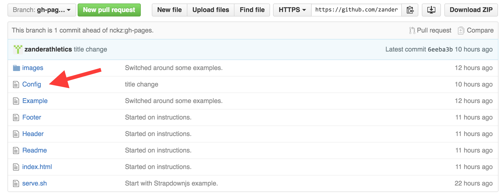
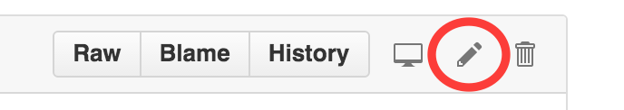
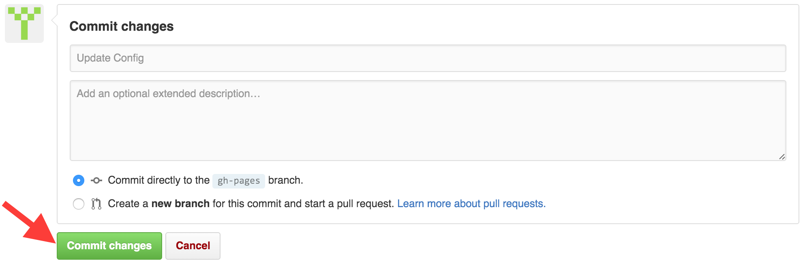

**GitStrap** is a simple Bootstrap template that allows web developers to
quickly generate a static web page on free hosting sites like
[GitHub](http://github.com) and [GitLab](http://gitlab.com).  This can be done
without any code/web development background or knowledge of the git versioning
system.  The requirements are:

* A [GitHub account](https://github.com/join?source=header-home)
* A modern web browser and connection to the internet
* 5 minutes

# Step 1 - Copy (i.e. 'Fork') This Project
Once you have a GitHub account you'll need to copy this project.  So head over
to the [GitStrap Project Page](https://github.com/nckz/GitStrap) and then
click the 'Fork' button in the upper right.

#### Fork

# Step 2 - Make Your First Commit
In order for GitStrap to show up under your project url, you'll have to make at
least one commit. -The Config file is a good place to start. Click on the
'Config' file.

#### Config

Then click the edit button (the pencil icon) in the upper right hand corner.

#### Edit

Rename the website by modifying the "Site Title" option.  When you're finished
Scroll to the bottom of the page and submit your changes by clicking the
"Commit changes" button.

#### Commit

# Step 3 - Check Your GitHub URL
Point your browser to the following address (replacing the `<username>` with your
GitHub username):

    https://<username>.github.io/GitStrap/

At this point you should see the sample GitStrap webpage with this 'Readme.md'
file displayed.

# Step 4 - Add Your Own Content
You can now start to add your own content via the "New file", "Upload files" and
'edit' (pencil button) capabilities within the GitHub website.

#### New File, Upload Files

You can start by modifying the text in any of the existing documents:
'Readme.md', 'Header', 'Footer', and 'Example'. If you create a new text file
using the "New file" button, make sure to add that file to the list of site
"Pages / Navigation" so that your new page shows up.

## Markdown
Your text content should be added in the Markdown format.  This is a simple
way of formatting text without requiring knowledge of html or css.  For a quick
intro you can start
[here](https://github.com/adam-p/markdown-here/wiki/Markdown-Cheatsheet).

## Images
Use the "Upload file" button to add images. For organization sake, upload your
new images to the existing 'images' folder.  They can then be added to your
site pages with the following Markdown tag:

#### ``

